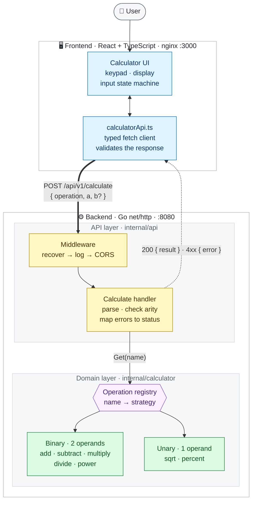

# Calculator App

A full-stack calculator: a Go REST API backend and a React + TypeScript frontend,
built with an emphasis on clean architecture, extensibility, and test coverage
over feature breadth.



Adding an operation means writing one strategy and registering it — the
handler, router, and frontend transport all stay untouched. `sqrt` and
`percent` were added to this diagram's **Unary** box exactly that way.

## Project layout

```
calculator-app/
├── backend/    # Go REST API (net/http, no framework)
├── frontend/   # React + TypeScript calculator UI (Vite)
├── docker-compose.yml
└── PROMPTS.md  # AI prompts used to build this project
```

## Setup

Prerequisites: [Go 1.25+](https://go.dev/dl/), [Node.js 22+](https://nodejs.org/)
(required by the test toolchain — jsdom/Vitest; the production build itself works on Node 20),
and optionally [Docker](https://www.docker.com/) to run the whole stack in containers.

### Run everything with Docker (recommended)

```bash
docker compose up --build
```

- Frontend: http://localhost:3000
- Backend API: http://localhost:8080

### Run locally without Docker

**Backend** (from `backend/`):

```bash
ALLOWED_ORIGIN=http://localhost:5173 go run ./cmd/server
```

On Windows PowerShell:

```powershell
$env:ALLOWED_ORIGIN="http://localhost:5173"; go run ./cmd/server
```

`ALLOWED_ORIGIN` must be set to the frontend's dev-server origin, otherwise the
browser blocks the response: the server sends CORS headers only for an origin
you explicitly allow, so there is no permissive default to fall back on.

Listens on `:8080` by default. Environment variables:

| Variable         | Default | Purpose                                             |
|------------------|---------|------------------------------------------------------|
| `PORT`           | `8080`  | HTTP listen port                                      |
| `ALLOWED_ORIGIN` | (empty) | Origin allowed via CORS (e.g. `http://localhost:5173`) |

**Frontend** (from `frontend/`):

```bash
npm install
npm run dev
```

Opens on http://localhost:5173. Set `VITE_API_BASE_URL` (in a `.env` file or the
environment) to point at a non-default backend URL; it defaults to
`http://localhost:8080`.

## Running tests

**Backend** (from `backend/`):

```bash
go test ./... -cover
```

Seed inputs for the fuzz target run as part of the normal suite; to explore
past them:

```bash
go test ./internal/api -fuzz=FuzzCalculate
```

Benchmarks are opt-in:

```bash
go test ./internal/api -run XXX -bench . -benchmem
```

**Frontend** (from `frontend/`):

```bash
npm run test       # run once
npm run coverage   # run with a coverage report
```

**End-to-end** (from `frontend/`, against a running `docker compose up`):

```bash
npm run test:e2e
```

Both suites also run in CI on every push/PR to `main`, along with `gofmt`,
`go vet`, `oxlint`, and `go test -race` (see
[`.github/workflows/ci.yml`](.github/workflows/ci.yml)).

### What each layer is for

**Unit tests** cover the pieces in isolation: the operation strategies, the
handler's validation and error mapping, the middleware, the API client, the
display formatters, and the keypad's state machine.

**A fuzz target** (`FuzzCalculate`) throws arbitrary bodies at the endpoint
and asserts the invariants that must always hold — never a 5xx, always valid
JSON, and a `200` always carries a finite result. That last one is not
theoretical: it is exactly what an earlier version violated by answering an
overflowing calculation with `200 OK` and an empty body. Disabling the fix
makes the seed corpus fail, so the test is known to catch the bug it was
written for.

**Benchmarks** keep an honest number against the claim that the server isn't
the bottleneck — a calculation costs single-digit microseconds against a
network round-trip measured in milliseconds. The parallel benchmark is also
where "the registry is read-only and safe to share" stops being an assertion.

**End-to-end tests** close the last gap. Unit tests on each side mock the
other — the frontend mocks its API client, the backend tests Go structs — so
if the two stopped agreeing on the wire format, or the keypad stopped being
wired up, everything would still pass. CI brings up the real `docker compose`
stack, checks the contract over HTTP (that `add` returns `result: 5`, that a
unary response omits `b`, that division by zero returns a `400` with a
displayable message, that a request's `X-Request-Id` reaches the backend
logs), and then drives the actual UI in Chromium at desktop and phone
viewports.

That last layer earned its place immediately: it caught a bug the unit tests
structurally could not. A clicked key kept browser focus, so pressing Enter
afterwards re-fired *that* key instead of `=` — only reachable by mixing mouse
and keyboard, which no unit test did.

## API

### `POST /api/v1/calculate`

Request body:

```json
{ "operation": "add", "a": 2, "b": 3 }
```

`operation` is one of:

| Operation                                  | Operands      | Example                                  |
|--------------------------------------------|---------------|------------------------------------------|
| `add`, `subtract`, `multiply`, `divide`     | `a` and `b`   | `{"operation":"add","a":2,"b":3}` → `5`   |
| `power` — `a` to the power of `b`           | `a` and `b`   | `{"operation":"power","a":2,"b":10}` → `1024` |
| `sqrt` — square root of `a`                 | `a` only      | `{"operation":"sqrt","a":9}` → `3`        |
| `percent` — `a` as a percentage             | `a` only      | `{"operation":"percent","a":50}` → `0.5`  |

Sending the wrong number of operands is rejected: `b` is required for the
two-operand forms and refused for the single-operand ones.

Success response (`200 OK`) echoes back the operands it used, so `b` appears
only for two-operand operations:

```json
{ "operation": "add", "a": 2, "b": 3, "result": 5 }
{ "operation": "sqrt", "a": 9, "result": 3 }
```

Error responses carry the same shape, `{"error": "..."}`:

| Status                      | When                                                                               |
|-----------------------------|------------------------------------------------------------------------------------|
| `400 Bad Request`           | Malformed JSON, missing/non-numeric operands, the wrong number of operands, unsupported operation, division by zero, square root of a negative, or a result outside float64 range |
| `413 Payload Too Large`     | Request body over 1 MiB                                                              |
| `405 Method Not Allowed`    | Any method other than `POST`                                                         |

Examples with `curl`:

```bash
curl -X POST http://localhost:8080/api/v1/calculate \
  -H "Content-Type: application/json" \
  -d '{"operation":"multiply","a":6,"b":7}'
# {"operation":"multiply","a":6,"b":7,"result":42}

curl -X POST http://localhost:8080/api/v1/calculate \
  -H "Content-Type: application/json" \
  -d '{"operation":"divide","a":1,"b":0}'
# {"error":"division by zero"}

curl -X POST http://localhost:8080/api/v1/calculate \
  -H "Content-Type: application/json" \
  -d '{"operation":"sqrt","a":9}'
# {"operation":"sqrt","a":9,"result":3}

curl -X POST http://localhost:8080/api/v1/calculate \
  -H "Content-Type: application/json" \
  -d '{"operation":"sqrt","a":9,"b":2}'
# {"error":"sqrt takes a single operand, \"a\""}

curl -X POST http://localhost:8080/api/v1/calculate \
  -H "Content-Type: application/json" \
  -d '{"operation":"multiply","a":1e308,"b":1e308}'
# {"error":"result is out of range"}
```

### `GET /healthz`

Returns `{"status":"ok"}` — used for container/orchestration health checks.

### `GET /metrics`

Prometheus exposition format. See [Observability](#observability).

## Observability

Every response carries an `X-Request-Id`, and that same ID appears on every
log line for the request — so a user reporting "it said Error at 3pm" can be
traced to the exact reason it failed:

```console
$ curl -i -X POST localhost:8080/api/v1/calculate -d '{"operation":"divide","a":1,"b":0}'
X-Request-Id: 9b0542fb5e465de5

$ docker compose logs backend | grep 9b0542fb5e465de5
{"level":"WARN","msg":"calculation rejected","status":400,"reason":"division by zero","request_id":"9b0542fb5e465de5"}
{"level":"INFO","msg":"request","method":"POST","path":"/api/v1/calculate","status":400,"duration_ms":0.12,"request_id":"9b0542fb5e465de5"}
```

Logs are JSON on stdout via `log/slog`, for the container runtime to collect.

`GET /metrics` exposes RED metrics — rate, errors, duration:

| Metric                                       | Labels                     |
|----------------------------------------------|----------------------------|
| `calculator_http_requests_total`             | method, route, status      |
| `calculator_http_request_duration_seconds`   | method, route              |
| `calculator_calculations_total`              | operation, outcome         |

The domain counter is the one worth having. HTTP status alone can't tell you
*which* operation is failing or why:

```
calculator_calculations_total{operation="add",outcome="success"} 2
calculator_calculations_total{operation="divide",outcome="domain_error"} 1
calculator_calculations_total{operation="multiply",outcome="out_of_range"} 1
calculator_calculations_total{operation="unknown",outcome="invalid_request"} 1
```

**Label cardinality is bounded on purpose.** Labelling by raw request path or
raw operation name would let any caller mint unlimited time series by sending
junk — enough to exhaust the memory of whatever scrapes it. Unmatched routes
collapse to `unmatched`, and operation names collapse to `unknown` until the
registry confirms them (which is why `factorial` appears as `unknown` above).
Routes are labelled by matched pattern, not URL.

## Design decisions

**Strategy pattern for operations.** Each arithmetic operation
(`AddOperation`, `SubtractOperation`, ...) implements a small `Operation`
interface and is resolved at request time through a `Registry`
(`backend/internal/calculator`). The HTTP handler only knows how to look an
operation up by name and call it — it has no `if operation == "add"` branching
and doesn't grow as operations are added. This is also why the API exposes a
single generic `POST /api/v1/calculate` endpoint (with an `operation` field)
rather than one route per operation: the endpoint already mirrors the
registry's shape, so it doesn't need to change either.

That claim got tested when `power`, `sqrt`, and `percent` were added after the
fact: each is one struct and one line in `DefaultRegistry`, and the router and
handler were untouched by the arithmetic itself.

**Arity lives on the operation.** `sqrt` and `percent` take one operand while
everything else takes two, so `Operation` declares an `Arity()` alongside
`Apply`. Operand count is client input like any other field, so the API layer
validates the request against the operation's arity and rejects a mismatch
with a `400` — the alternative, a phantom second parameter that unary
operations quietly ignore, would let `{"operation":"sqrt","a":9,"b":2}` look
like it worked.

**`percent` follows the pocket-calculator convention** — it divides by 100, so
`50` becomes `0.5`, rather than computing "b percent of a". The UI mimics a
phone calculator, and that is what `%` does there.

**No web framework on the backend.** With seven operations behind three routes,
a third-party router/framework would add a dependency without solving a real
problem. Go's stdlib `net/http` (1.22+ method-aware `ServeMux`) plus ~120 lines
of hand-written middleware (request IDs, recover, logging, metrics, CORS)
covers everything needed here idiomatically.

**One dependency, deliberately.** The Prometheus client is the project's only
third-party import, which is a considered exception rather than a loosened
rule: the objection to a web framework is that stdlib already routes two paths
perfectly well, whereas stdlib has no histograms and no labelled counters, so
`expvar` would mean hand-rolling percentile buckets and per-operation maps to
end up somewhere worse. A library earns its place when it does something the
standard library genuinely can't.

**No tracing.** It would be ceremony here — one hop, no database, no fan-out,
no queue, so every trace would be a single span restating the access log.
Traces earn their keep when there's a call graph to reconstruct; this service
doesn't have one yet.

**Error handling.** Domain errors (`ErrDivisionByZero`, `ErrNegativeSquareRoot`,
`ErrUnknownOperation`) are plain Go sentinel errors, kept independent of HTTP
concerns; the API layer is the only place that maps them to status codes and
JSON bodies. All validation failures — malformed JSON, missing or mis-counted
operands, non-numeric operands, unknown operations, division by zero, the
square root of a negative — return `400` with a `{"error": "..."}` body, since
all of them are client input problems rather than server faults.

Two related edge cases are handled explicitly rather than left to chance.
Operands that are individually valid can still produce a result that isn't
(`1e308 * 1e308` overflows to `+Inf`), and JSON cannot represent `Inf`/`NaN`,
so the handler rejects non-finite results with a `400` instead of failing at
encoding time. As a backstop, `writeJSON` serializes *before* writing the
status line, so a value it cannot encode produces a `500` rather than a
successful-looking empty `200`. Request bodies are capped at 1 MiB via
`http.MaxBytesReader` so an oversized upload can't make the server allocate on
a caller's behalf.

**A real calculator UI.** The frontend renders an actual calculator (digit
grid, display, operator keys) rather than plain input boxes — this also makes
`=` and the operator keys map directly onto the backend's single `/calculate`
call. Unary keys act on the displayed value immediately and leave any pending
operation alone, so `5 + 9 √ =` adds 5 to the root of 9.

**Illegal states are unrepresentable on the frontend too.** Input lives in a
pure reducer (`src/calculator/machine.ts`) whose shape carries the invariants.
An earlier version kept six loose fields — `display`, `storedValue`,
`pendingOperation`, `overwrite`, `error`, `loading` — whose legal combinations
were only implied: an error had to coincide with a display of `"Error"`, a
pending operation had to coincide with a stored operand, and a request in
flight had to coincide with a display nobody should read. The code ended up
defending against combinations it couldn't rule out, with a `?? 0` fallback
and null checks for cases that shouldn't exist. Now the view is exactly one of
`value | busy | error`, and an operation cannot exist apart from the operand
it is waiting on, so those states can't be built rather than being guarded.

The payoff is testability. Verifying "a unary key leaves a pending operation
untouched" used to mean rendering a component, mocking a module and firing DOM
events; it is now three function calls on a reducer. `useCalculator` keeps the
I/O — requests, cancellation, error mapping — and the component is left as
presentation.

**One cancellation mechanism, not two.** A request's deadline and a user
pressing `C` are the same thing — "this answer is no longer wanted" — so both
drive a single `AbortController`. Clearing now actually aborts the in-flight
HTTP request instead of merely ignoring its reply.

**Secondary functions get their own row.** `√`, `xʸ`, and `%` sit above the
keypad instead of becoming a fifth column, so the four-column phone layout —
and the muscle memory that comes with it — survives the addition.

**Keyboard support.** Digits, `.`, `+ - * / ^`, `r` (root), `%`, `Enter`/`=`,
and `Esc`/`C` all work from a physical keyboard. Every shortcut maps to a key
that also exists on screen, so neither input method can do something the other
can't.

**The keypad locks during a request, except `C`.** A resolved calculation
replaces the whole display, so input accepted mid-flight would be silently
discarded — hence the lock. But a lock with no exceptions means a hung backend
traps the user with a dead keypad and no way out, so clear stays live, and
clearing invalidates the in-flight request by bumping an epoch counter that a
late reply is checked against. Requests also carry an 8 second deadline, so a
connection that never answers surfaces as an error rather than a spinner.

**UI/UX heuristics applied to the keypad:**
- *Fitts's Law* — every key stays at or above the ~44px minimum recommended
  touch-target size, even on small phones, and primary keys (operators, `=`)
  are enlarged and colour-coded for faster, more forgiving hits.
- *Miller's Law* — results are grouped into thousands (`998,001` rather than
  `998001`) purely for display, so long numbers stay easy to parse at a
  glance instead of reading as one undifferentiated digit run.
- *Jakob's Law* — the layout follows the familiar phone-calculator
  convention (grey digits, orange operators, wide `0` key) so no one has to
  learn a new mental model to use it, and `%` behaves the way it does there.
- *Hick's Law* — the keypad shows only the operations the API supports, with
  secondary functions visually separated from the primary arithmetic, so the
  common path isn't competing with the rarer one for attention.

**Responsive design.** The keypad is a CSS grid with `clamp()`-based type
sizing and breakpoints down to ~340px, so it stays usable on a phone-width
viewport without a separate mobile layout.

## What's not included

- Authentication/authorization (out of scope for a calculator API).
- Memory keys, sign toggle, and calculation history — the state machine has no
  concept of them, and they'd be UI-only features with nothing to exercise on
  the API side.
- A production TLS/reverse-proxy setup — `docker-compose.yml` is meant for
  local evaluation, not production deployment.
- A backspace/undo key — the keypad has no such button, and adding it only to
  the keyboard would put the two input methods out of sync.

## License

[MIT](LICENSE).
