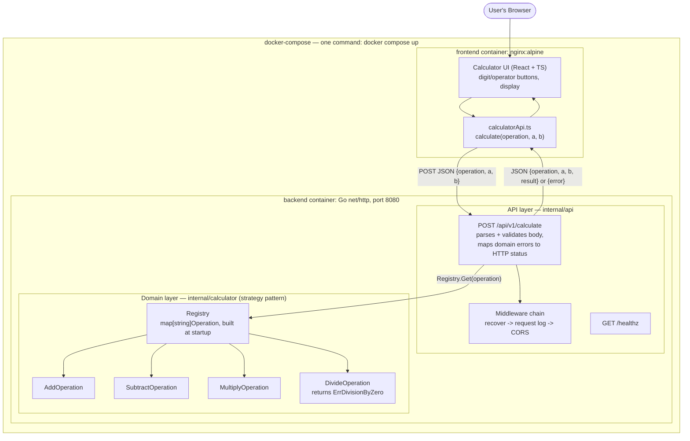

# Calculator App

A full-stack calculator: a Go REST API backend and a React + TypeScript frontend,
built with an emphasis on clean architecture, extensibility, and test coverage
over feature breadth.



## Project layout

```
calculator-app/
├── backend/    # Go REST API (net/http, no framework)
├── frontend/   # React + TypeScript calculator UI (Vite)
├── docker-compose.yml
└── PROMPTS.md  # AI prompts used to build this project
```

## Setup

Prerequisites: [Go 1.23+](https://go.dev/dl/), [Node.js 22+](https://nodejs.org/)
(required by the test toolchain — jsdom/Vitest; the production build itself works on Node 20),
and optionally [Docker](https://www.docker.com/) to run the whole stack in containers.

### Run everything with Docker (recommended)

```bash
docker compose up --build
```

- Frontend: http://localhost:3000
- Backend API: http://localhost:8080

### Run locally without Docker

**Backend** (from `backend/`):

```bash
ALLOWED_ORIGIN=http://localhost:5173 go run ./cmd/server
```

On Windows PowerShell:

```powershell
$env:ALLOWED_ORIGIN="http://localhost:5173"; go run ./cmd/server
```

`ALLOWED_ORIGIN` must be set to the frontend's dev-server origin, otherwise the
browser blocks the response: the server sends CORS headers only for an origin
you explicitly allow, so there is no permissive default to fall back on.

Listens on `:8080` by default. Environment variables:

| Variable         | Default | Purpose                                             |
|------------------|---------|------------------------------------------------------|
| `PORT`           | `8080`  | HTTP listen port                                      |
| `ALLOWED_ORIGIN` | (empty) | Origin allowed via CORS (e.g. `http://localhost:5173`) |

**Frontend** (from `frontend/`):

```bash
npm install
npm run dev
```

Opens on http://localhost:5173. Set `VITE_API_BASE_URL` (in a `.env` file or the
environment) to point at a non-default backend URL; it defaults to
`http://localhost:8080`.

## Running tests

**Backend** (from `backend/`):

```bash
go test ./... -cover
```

**Frontend** (from `frontend/`):

```bash
npm run test       # run once
npm run coverage   # run with a coverage report
```

Both suites also run in CI on every push/PR to `main` (see
[`.github/workflows/ci.yml`](.github/workflows/ci.yml)).

## API

### `POST /api/v1/calculate`

Request body:

```json
{ "operation": "add", "a": 2, "b": 3 }
```

`operation` is one of `add`, `subtract`, `multiply`, `divide`.

Success response (`200 OK`):

```json
{ "operation": "add", "a": 2, "b": 3, "result": 5 }
```

Error responses carry the same shape, `{"error": "..."}`:

| Status                      | When                                                                               |
|-----------------------------|------------------------------------------------------------------------------------|
| `400 Bad Request`           | Malformed JSON, missing/non-numeric operands, unsupported operation, division by zero, or a result outside float64 range |
| `413 Payload Too Large`     | Request body over 1 MiB                                                              |
| `405 Method Not Allowed`    | Any method other than `POST`                                                         |

Examples with `curl`:

```bash
curl -X POST http://localhost:8080/api/v1/calculate \
  -H "Content-Type: application/json" \
  -d '{"operation":"multiply","a":6,"b":7}'
# {"operation":"multiply","a":6,"b":7,"result":42}

curl -X POST http://localhost:8080/api/v1/calculate \
  -H "Content-Type: application/json" \
  -d '{"operation":"divide","a":1,"b":0}'
# {"error":"division by zero"}

curl -X POST http://localhost:8080/api/v1/calculate \
  -H "Content-Type: application/json" \
  -d '{"operation":"multiply","a":1e308,"b":1e308}'
# {"error":"result is out of range"}
```

### `GET /healthz`

Returns `{"status":"ok"}` — used for container/orchestration health checks.

## Design decisions

**Strategy pattern for operations.** Each arithmetic operation
(`AddOperation`, `SubtractOperation`, ...) implements a small `Operation`
interface and is resolved at request time through a `Registry`
(`backend/internal/calculator`). The HTTP handler only knows how to look an
operation up by name and call it — it has no `if operation == "add"` branching
and doesn't grow as operations are added. Supporting a new operation later
(e.g. `sqrt`, `%`) is one new struct plus one registration line, with zero
changes to the router, handler, or any existing operation. This is also why
the API exposes a single generic `POST /api/v1/calculate` endpoint (with an
`operation` field) rather than one route per operation: the endpoint already
mirrors the registry's shape, so it doesn't need to change either.

**No web framework on the backend.** With four operations and two routes, a
third-party router/framework would add a dependency without solving a real
problem. Go's stdlib `net/http` (1.22+ method-aware `ServeMux`) plus ~60 lines
of hand-written middleware (recover, logging, CORS) covers everything needed
here idiomatically.

**Error handling.** Domain errors (`ErrDivisionByZero`, `ErrUnknownOperation`)
are plain Go sentinel errors, kept independent of HTTP concerns; the API layer
is the only place that maps them to status codes and JSON bodies. All
validation failures — malformed JSON, missing operands, non-numeric operands,
unknown operations, division by zero — return `400` with a `{"error": "..."}`
body, since all of them are client input problems rather than server faults.

Two related edge cases are handled explicitly rather than left to chance.
Operands that are individually valid can still produce a result that isn't
(`1e308 * 1e308` overflows to `+Inf`), and JSON cannot represent `Inf`/`NaN`,
so the handler rejects non-finite results with a `400` instead of failing at
encoding time. As a backstop, `writeJSON` serializes *before* writing the
status line, so a value it cannot encode produces a `500` rather than a
successful-looking empty `200`. Request bodies are capped at 1 MiB via
`http.MaxBytesReader` so an oversized upload can't make the server allocate on
a caller's behalf.

**No extra operations in scope.** Exponentiation/sqrt/percentage were left out
deliberately so the available time went into architecture and test coverage
instead of feature count — and the strategy-registry design above is exactly
what makes adding them later cheap.

**A real calculator UI.** The frontend renders an actual calculator (digit
grid, display, operator keys) with a small state machine for digit entry,
decimal handling, and operator chaining, rather than plain input boxes — this
also makes `=` and the operator keys map directly onto the backend's single
`/calculate` call.

**Keyboard support.** Digits, `.`, `+ - * /`, `Enter`/`=`, and `Esc`/`C` all
work from a physical keyboard. Every shortcut maps to a key that also exists
on screen, so neither input method can do something the other can't — and the
keypad is disabled while a request is in flight, so input can't be silently
dropped by the response that replaces the display.

**UI/UX heuristics applied to the keypad:**
- *Fitts's Law* — every key stays at or above the ~44px minimum recommended
  touch-target size, even on small phones, and primary keys (operators, `=`)
  are enlarged and colour-coded for faster, more forgiving hits.
- *Miller's Law* — results are grouped into thousands (`998,001` rather than
  `998001`) purely for display, so long numbers stay easy to parse at a
  glance instead of reading as one undifferentiated digit run.
- *Jakob's Law* — the layout follows the familiar phone-calculator
  convention (grey digits, orange operators, wide `0` key) so no one has to
  learn a new mental model to use it.

**Responsive design.** The keypad is a CSS grid with `clamp()`-based type
sizing and breakpoints down to ~340px, so it stays usable on a phone-width
viewport without a separate mobile layout.

## What's not included

- Authentication/authorization (out of scope for a calculator API).
- Extra operations (exponentiation, square root, percentage) — intentionally
  deferred; see "Design decisions" above for why the architecture makes them
  cheap to add later.
- A production TLS/reverse-proxy setup — `docker-compose.yml` is meant for
  local evaluation, not production deployment.
- A backspace/undo key — the keypad has no such button, and adding it only to
  the keyboard would put the two input methods out of sync.

## License

[MIT](LICENSE).
