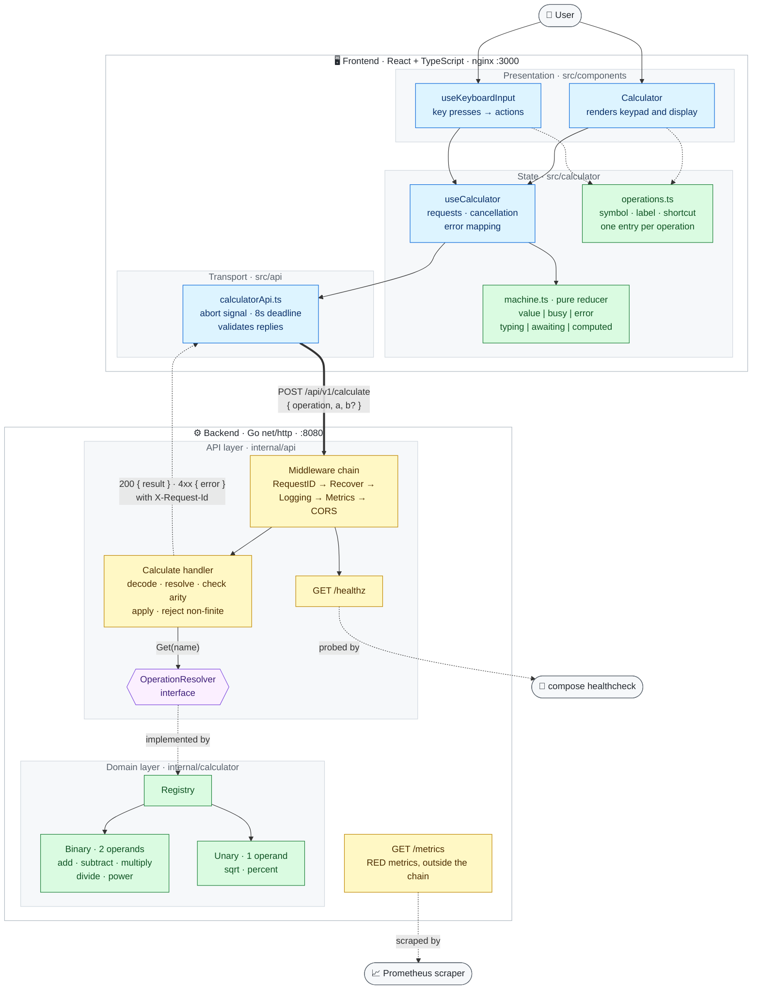

# Calculator App

A calculator with a Go REST API backend and a React + TypeScript frontend.



Blue: frontend React and network code. Yellow: HTTP layer. Green: logic with
no I/O. Purple: the interface between the API layer and the domain.

## Project layout

```
calculator-app/
├── backend/            # Go REST API
├── frontend/           # React + TypeScript UI (Vite)
├── docker-compose.yml
├── PROMPTS.md          # prompts used to build the project
└── LICENSE
```

## Setup

Requirements: [Go 1.25+](https://go.dev/dl/), [Node.js 22+](https://nodejs.org/)
(needed for the tests; the production build runs on Node 20), and optionally
[Docker](https://www.docker.com/).

### Docker

```bash
docker compose up --build
```

- Frontend: http://localhost:3000
- API: http://localhost:8080

### Without Docker

Backend, from `backend/`:

```bash
ALLOWED_ORIGIN=http://localhost:5173 go run ./cmd/server
```

PowerShell:

```powershell
$env:ALLOWED_ORIGIN="http://localhost:5173"; go run ./cmd/server
```

The server sends CORS headers only for `ALLOWED_ORIGIN`. Without it, the
browser blocks requests from the dev server.

| Variable         | Default | Purpose                  |
|------------------|---------|--------------------------|
| `PORT`           | `8080`  | HTTP port                |
| `ALLOWED_ORIGIN` | empty   | Origin allowed by CORS   |

Frontend, from `frontend/`:

```bash
npm install
npm run dev
```

Runs on http://localhost:5173. Set `VITE_API_BASE_URL` to use a different
backend URL (default `http://localhost:8080`).

## Tests

```bash
# backend/
go test ./... -cover
go test ./internal/api -fuzz=FuzzCalculate          # fuzzing beyond the seed corpus
go test ./internal/api -run XXX -bench . -benchmem  # benchmarks

# frontend/
npm run test
npm run coverage
npm run test:e2e   # needs `docker compose up`
```

- **Unit tests:** operations, handler validation and error mapping,
  middleware, API client, formatters, and the input state machine.
- **Fuzz test:** `FuzzCalculate` sends arbitrary request bodies and checks that
  every response is JSON, never a 5xx, and that a `200` always has a finite
  result.
- **Benchmarks:** a request takes about 6 µs, so network latency dominates.
- **End-to-end:** CI starts the Compose stack, checks the API contract with
  curl, and runs Playwright against the UI at desktop and mobile sizes.

CI (`.github/workflows/ci.yml`) also runs `gofmt`, `go vet`, `go test -race`
and `oxlint` on every push and pull request to `main`.

## API

### `POST /api/v1/calculate`

```json
{ "operation": "add", "a": 2, "b": 3 }
```

| Operation                                | Operands    | Example                                          |
|------------------------------------------|-------------|--------------------------------------------------|
| `add`, `subtract`, `multiply`, `divide`  | `a` and `b` | `{"operation":"add","a":2,"b":3}` → `5`          |
| `power` (`a` to the power of `b`)        | `a` and `b` | `{"operation":"power","a":2,"b":10}` → `1024`    |
| `sqrt` (square root of `a`)              | `a`         | `{"operation":"sqrt","a":9}` → `3`               |
| `percent` (`a` ÷ 100)                    | `a`         | `{"operation":"percent","a":50}` → `0.5`         |

A wrong number of operands is rejected. Responses include `b` only for
two-operand operations:

```json
{ "operation": "add", "a": 2, "b": 3, "result": 5 }
{ "operation": "sqrt", "a": 9, "result": 3 }
```

Errors return `{"error": "..."}`:

| Status | When |
|--------|------|
| `400`  | Invalid JSON, missing or non-numeric operands, wrong operand count, unknown operation, division by zero, square root of a negative, result out of range |
| `413`  | Body larger than 1 MiB |
| `405`  | Method other than `POST` |

```bash
curl -X POST http://localhost:8080/api/v1/calculate \
  -H "Content-Type: application/json" \
  -d '{"operation":"multiply","a":6,"b":7}'
# {"operation":"multiply","a":6,"b":7,"result":42}

curl -X POST http://localhost:8080/api/v1/calculate \
  -H "Content-Type: application/json" \
  -d '{"operation":"divide","a":1,"b":0}'
# {"error":"division by zero"}

curl -X POST http://localhost:8080/api/v1/calculate \
  -H "Content-Type: application/json" \
  -d '{"operation":"sqrt","a":9,"b":2}'
# {"error":"sqrt takes a single operand, \"a\""}
```

### `GET /healthz`

Returns `{"status":"ok"}`. Used by the Compose healthcheck.

### `GET /metrics`

Prometheus metrics.

## Observability

- **Logs:** JSON on stdout via `log/slog`.
- **Request IDs:** every response has an `X-Request-Id` header, and the same ID
  is on every log line for that request.
- **Metrics:**

| Metric                                     | Labels                |
|--------------------------------------------|-----------------------|
| `calculator_http_requests_total`           | method, route, status |
| `calculator_http_request_duration_seconds` | method, route         |
| `calculator_calculations_total`            | operation, outcome    |

`calculator_calculations_total` shows which operations fail and why
(`success`, `invalid_request`, `domain_error`, `out_of_range`). Label values
are limited to known sets: unmatched routes are recorded as `unmatched` and
unregistered operations as `unknown`, so client input can't create new time
series.

## Design decisions

### Backend

- **Strategy registry behind one endpoint.** Each operation implements
  `Operation` (`Name`, `Arity`, `Apply`) and is registered in a `Registry`. The
  handler finds operations by name through the `OperationResolver` interface,
  so adding an operation doesn't change the handler, router or endpoint.
- **Arity is part of the operation.** `sqrt` and `percent` take one operand.
  The handler compares the operand count with `Arity()` and returns `400` on a
  mismatch instead of ignoring extra input.
- **`percent` divides by 100**, like the `%` key on a phone calculator.
- **Standard library for HTTP.** Three routes don't need a framework;
  `net/http` routing and a few middleware functions are enough.
- **Prometheus client is the only dependency.** The standard library has no
  histograms or labelled counters.
- **No tracing.** There are no downstream calls, so a trace would only repeat
  the access log.
- **Error handling.** Domain errors are sentinel errors; only the API layer
  maps them to HTTP statuses. All client input problems return `400`.
  Non-finite results are rejected because JSON can't encode `Inf` or `NaN`.
  Responses are encoded before the status is written, so an encoding failure
  returns `500` rather than an empty `200`. Bodies over 1 MiB return `413`.

### Frontend

- **Input is a state machine.** A pure reducer (`machine.ts`) holds the input
  rules. The view is `value`, `busy` or `error`; a pending operation always
  carries its operand; and `entry` (`typing`, `awaiting`, `computed`) decides
  whether the next operator calculates or replaces the pending one. Invalid
  combinations can't be represented, and the rules are tested without
  rendering anything.
- **Hooks separate responsibilities.** `useCalculator` handles requests,
  cancellation and errors; `useKeyboardInput` maps keys to actions;
  `Calculator` only renders.
- **One table for operations.** `operations.ts` stores each operation's
  symbol, key label and shortcut. It is keyed by the operation types, so a new
  operation doesn't compile until it has an entry.
- **Requests can be cancelled.** Each request has an `AbortController` and an
  8-second timeout. Keys are disabled while a request is running so input
  isn't lost; `C` stays enabled and aborts the request.
- **Responses are validated.** The API client rejects any response without a
  finite `result`.

### UI

- **Phone calculator layout.** Four columns of circular keys. `√`, `%` and
  `xʸ` are in a separate row so the main layout stays familiar.
- **Context line.** The line above the value shows the calculation in
  progress (`12 +`) or the error message. Its space is always reserved, so the
  keypad never moves.
- **UX laws.** Fitts's: every key is at least 44 px. Miller's: results use
  thousands separators. Jakob's: standard calculator layout and `%` behaviour.
  Hick's: secondary functions are separated from the main keys.
- **Keyboard support.** Every key has a shortcut (`+ - * / ^`, `r` for root,
  `%`, `Enter`, `Esc`), and every shortcut has an on-screen key.
- **Responsive.** CSS grid with `clamp()` sizing, usable down to about 340 px.

## Not included

- Authentication.
- Memory keys, sign toggle, backspace and history.
- Production TLS or reverse proxy; `docker-compose.yml` is for local use.

## License

[MIT](LICENSE)
